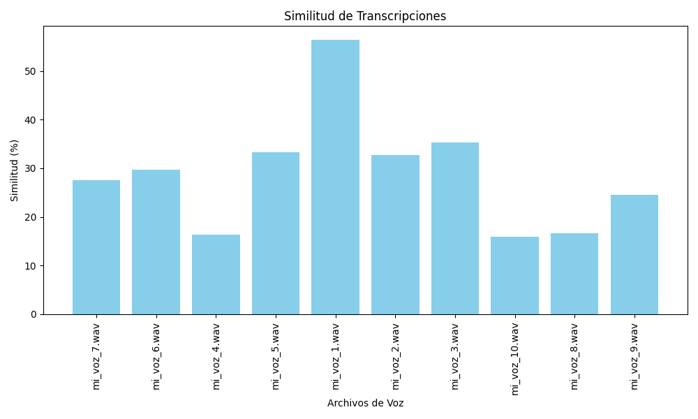

# Python Samples 2025

Este repositorio contiene una colección de scripts de Python diseñados para como integrar un modelo de reconocimiento de voces ligero para reconocer solo mi voz en un entorno domótico. Se trata de aprender que se puede hacer con mi modesto hardware en una primera aproximación naive al problema.
He iterado poco a poco, de manera que el mejor ejemplo, creo, es voice_auth_vosk_improved.py. 

Por motivos de compatibilidad, no puedo usar torch ni librerias que dependan de torch. El soporte en osx/intel es penoso, simplemente me cansé de
pelear. Cuando tenga un equipo con linux y NVIDIA, lo retomaré.

Tratará de descargarse un modelo VOSK de Español de España, te pedirá que grabes tu voz de referencia, y luego te dará un puntuación.
Algo así:

    python-samples-2025-py3.10┌<▸> ~/g/python-samples-2025 
    └➤ poetry run python src/python_samples_2025/voice_auth_vosk_improved.py
    Contenido de model: ['vosk-model-small-es-0.22', 'vosk-model-small-en-us-0.15']
    Modelo Vosk cargado desde model/vosk-model-small-es-0.22.
    LOG (VoskAPI:ReadDataFiles():model.cc:213) Decoding params beam=13 max-active=7000 lattice-beam=4
    LOG (VoskAPI:ReadDataFiles():model.cc:216) Silence phones 1:2:3:4:5:6:7:8:9:10
    LOG (VoskAPI:RemoveOrphanNodes():nnet-nnet.cc:948) Removed 0 orphan nodes.
    LOG (VoskAPI:RemoveOrphanComponents():nnet-nnet.cc:847) Removing 0 orphan components.
    LOG (VoskAPI:ReadDataFiles():model.cc:248) Loading i-vector extractor from model/vosk-model-small-es-0.22/ivector/final.ie
    LOG (VoskAPI:ComputeDerivedVars():ivector-extractor.cc:183) Computing derived variables for iVector extractor
    LOG (VoskAPI:ComputeDerivedVars():ivector-extractor.cc:204) Done.
    LOG (VoskAPI:ReadDataFiles():model.cc:282) Loading HCL and G from model/vosk-model-small-es-0.22/graph/HCLr.fst model/vosk-model-small-es-0.22/graph/Gr.fst
    LOG (VoskAPI:ReadDataFiles():model.cc:303) Loading winfo model/vosk-model-small-es-0.22/graph/phones/word_boundary.int
    prueba_voz.wav ya existe. Usando archivo existente.
    Iniciando el proceso de obtención del vector de identidad desde prueba_voz.wav...
    LOG (VoskAPI:ReadDataFiles():model.cc:213) Decoding params beam=13 max-active=7000 lattice-beam=4
    LOG (VoskAPI:ReadDataFiles():model.cc:216) Silence phones 1:2:3:4:5:6:7:8:9:10
    LOG (VoskAPI:RemoveOrphanNodes():nnet-nnet.cc:948) Removed 0 orphan nodes.
    LOG (VoskAPI:RemoveOrphanComponents():nnet-nnet.cc:847) Removing 0 orphan components.
    LOG (VoskAPI:ReadDataFiles():model.cc:248) Loading i-vector extractor from model/vosk-model-small-es-0.22/ivector/final.ie
    LOG (VoskAPI:ComputeDerivedVars():ivector-extractor.cc:183) Computing derived variables for iVector extractor
    LOG (VoskAPI:ComputeDerivedVars():ivector-extractor.cc:204) Done.
    LOG (VoskAPI:ReadDataFiles():model.cc:282) Loading HCL and G from model/vosk-model-small-es-0.22/graph/HCLr.fst model/vosk-model-small-es-0.22/graph/Gr.fst
    LOG (VoskAPI:ReadDataFiles():model.cc:303) Loading winfo model/vosk-model-small-es-0.22/graph/phones/word_boundary.int
    Vector de identidad obtenido: [0.85556307 0.44362927 0.95416598 0.18943486 0.19812118 0.51506702
    0.26700666 0.82000407 0.08342998 0.96023583 0.64296274 0.69361647
    0.85246507 0.71307937 0.10579016 0.18423652 0.45833404 0.34310829
    0.71627827 0.04099809 0.58974561 0.64828824 0.07269932 0.45606774
    0.57857252 0.2590926  0.52832931 0.88626315 0.78983963 0.85468446
    0.2754162  0.67473289 0.56564501 0.68440803 0.53294777 0.98769967
    0.76442222 0.34471295 0.15411009 0.10067398 0.91450078 0.65503251
    0.44925999 0.01459388 0.626034   0.61064334 0.55068199 0.63801075
    0.59309061 0.28290615 0.00383567 0.22101688 0.34139739 0.3694473
    0.98657592 0.64001855 0.34527607 0.97222014 0.44998658 0.98190029
    0.23895365 0.74456785 0.54283969 0.41263058 0.24896468 0.22028181
    0.44914403 0.58721964 0.46402004 0.04010954 0.13318742 0.42644191
    0.30738919 0.44113128 0.96264133 0.89741731 0.54577848 0.39683165
    0.91402533 0.25784251 0.53013347 0.09816971 0.02119632 0.92048261
    0.28829215 0.48461567 0.39148393 0.98182831 0.90864589 0.95968734
    0.87216153 0.32674146 0.47812349 0.02465922 0.46147446 0.95624569
    0.07494452 0.61488425 0.56385641 0.46571251 0.32821255 0.20317904
    0.77726974 0.67165581 0.50781263 0.21047157 0.7669176  0.76914494
    0.75357393 0.29621133 0.03540325 0.94218006 0.20269055 0.56493824
    0.01958156 0.97593827 0.8843925  0.76434001 0.04084083 0.88447438
    0.76442737 0.95754726 0.99596363 0.399943   0.82006849 0.47586276
    0.49931892 0.40937516 0.43155597 0.46859039 0.10261962 0.09407889
    0.9075953  0.15376006 0.20642962 0.88449754 0.76819936 0.64557384
    0.90699947 0.7071508  0.98385643 0.48981117 0.18934906 0.1099766
    0.89952241 0.85532004 0.80420034 0.45441244 0.50470591 0.55100968
    0.22116438 0.70420054 0.69941714 0.97165061 0.94287435 0.53773823
    0.651847   0.22275282 0.48894752 0.5539405  0.39998395 0.49858882
    0.45881125 0.86789112 0.68626762 0.9484235  0.64542564 0.08687117
    0.81594665 0.82533935 0.89227204 0.03950218 0.32051137 0.45131034
    0.20124339 0.65475707 0.3242069  0.53656398 0.74962518 0.97227178
    0.28120423 0.77071744 0.57506838 0.20155757 0.0855769  0.77681281
    0.99327495 0.83714375 0.87755583 0.01611545 0.08489583 0.15034209
    0.69928864 0.29397651 0.44514076 0.78185351 0.80357785 0.94443264
    0.32015089 0.18171079 0.77624114 0.1818072  0.7235022  0.6835088
    0.15972237 0.79396103 0.22102965 0.90929425 0.60145097 0.68386388
    0.781499   0.56208427 0.13779854 0.19443484 0.25625391 0.56291931
    0.38015385 0.63533579 0.8491089  0.81584718 0.11894373 0.92902942
    0.89408844 0.43102626 0.85306281 0.38690866 0.81199337 0.74295867
    0.85548275 0.47759531 0.38074374 0.03509321 0.85921972 0.41691208
    0.73633209 0.64357558 0.88338938 0.92258947 0.10545478 0.30821061
    0.44134306 0.74712976 0.10662334 0.33964629 0.32426987 0.53797599
    0.13883688 0.42252742 0.1906971  0.68690544 0.08255101 0.06859234
    0.95672169 0.97293916 0.18947774 0.45282069 0.85744354 0.70791265
    0.20189892 0.20505324 0.06232774 0.47026983 0.86867397 0.77226318
    0.86946941 0.18876355 0.90685685 0.28968407 0.64099445 0.01824769
    0.4136579  0.98362759 0.8524888  0.04949094 0.64192195 0.62103146
    0.31738695 0.42226447 0.45235878 0.32256308 0.4227393  0.31906669
    0.93312592 0.29016886 0.57670452 0.53972749 0.58987371 0.65539338
    0.85451751 0.78352232 0.45280929 0.08040595 0.01068969 0.77458405
    0.65899344 0.42095907 0.36798738 0.56192061 0.01468205 0.08991142
    0.11035684 0.30235034 0.75624256 0.80900306 0.84315317 0.74011618
    0.19762445 0.56089758 0.58957786 0.67390835 0.19167534 0.09244141
    0.68869369 0.2425882  0.51696542 0.42854475 0.02176679 0.53236325
    0.16788072 0.15002055 0.49660248 0.0185898  0.16845973 0.52241694
    0.34605753 0.21956814 0.67989034 0.58218291 0.72446409 0.47837845
    0.30300649 0.21533049 0.83734386 0.52637459 0.25085847 0.81593314
    0.22936785 0.82333396 0.20225643 0.34789768 0.36584032 0.07522507
    0.36155206 0.63832499 0.58319162 0.09556302 0.90826289 0.46508346
    0.62297963 0.23087207 0.37106967 0.30870529 0.1979908  0.91072907
    0.62669553 0.08410172 0.38458533 0.20869383 0.67028423 0.56795782
    0.11013668 0.44258798 0.87072488 0.46173699 0.45098746 0.3621018
    0.00693308 0.61119762 0.11387575 0.09378709 0.15252635 0.4675131
    0.06169008 0.17176297 0.3888272  0.68360322 0.87115162 0.62030292
    0.61245998 0.4042545  0.31809866 0.76473311 0.61147561 0.86744555
    0.25976868 0.5341018  0.99928262 0.7265101  0.80670209 0.06528716
    0.99464133 0.4611257  0.60985794 0.26974701 0.98492213 0.21370803
    0.21515864 0.90675169 0.46091858 0.58251723 0.98944635 0.17803753
    0.50154589 0.90293582 0.74794456 0.32028212 0.18912937 0.0338681
    0.59976931 0.71349718 0.45611044 0.11069761 0.30389262 0.76866043
    0.32566253 0.89274982 0.12964296 0.46834418 0.03124901 0.14125917
    0.95286828 0.56584014 0.25756119 0.93665145 0.00694165 0.70288476
    0.33445187 0.66450505 0.39990268 0.98311631 0.40004097 0.07904805
    0.13403149 0.66233457 0.0537652  0.41937108 0.63406001 0.11791567
    0.13363074 0.45881023 0.31808476 0.61598583 0.95560675 0.16895452
    0.34908167 0.29210972 0.91597498 0.59281297 0.12357912 0.63297055
    0.54742335 0.54152639 0.32418971 0.60017128 0.73333978 0.92049714
    0.76065453 0.13072494 0.3245487  0.27007606 0.8949258  0.19244013
    0.42189869 0.02531193 0.22951036 0.84277382 0.57657514 0.3673553
    0.58902714 0.62062285 0.60286331 0.28080946 0.81637204 0.58380351
    0.69170037 0.47083255 0.57555184 0.57197512 0.37314949 0.73494098
    0.45494026 0.09231529 0.80533312 0.15573279 0.73308719 0.56554031
    0.17053238 0.58843326 0.67816448 0.07625613 0.50025362 0.83975933
    0.50834436 0.83689651 0.24721788 0.05184497 0.17861464 0.68299064
    0.75036328 0.34206657 0.3550021  0.01890171 0.85635542 0.81331683
    0.78799715 0.27501573 0.81134795 0.29521787 0.02183577 0.47732241
    0.03059571 0.18422364]
    Similitud calculada: 0.7334
    Similitud moderada. Puede que sea la misma persona, pero no es 100% seguro.
    Puntuación final: 73.34 / 100
    Proceso de autenticación de voz finalizado.
    python-samples-2025-py3.10┌<▸> ~/g/python-samples-2025
    └➤

Como se puede observar, la puntuación no es muy alta, supongo que se deberá a la calidad de mi hardware de grabación, al modelo, al código, o a todo a la vez. El caso es que creo que he aprendido lo que quería.


## Contenido

- `voice_auth_vosk_improved.py`: Este script muestra cómo realizar operaciones básicas con el modelo VOSK para reconocimiento de voz.
- `voice_auth_vosk_.py`: Como el anterior, pero más cutre.
- `my_voice.py`: graba tu voz en un fichero.
- `rag_ollama_transcriber`: Carga ficheros en un BD vectorial in memory, usa librerias para recoger tu voz, la transcribe y la pasa a un modelo LLM cargado en ollama para que pregunte a esa base de datos vectorial. Te deja elegir el modelo que tengas en ollama.
- `rag_transcriber.py`: Como el anterior, pero con el RAG y sin ollama.
- `transcriber.py`: Como el anterior, pero sin el RAG y sin ollama.
- `speech.py`: Usa speech_recognition. No es muy buena. 

## Requisitos

- Python 3.8 o superior
- Librerías adicionales especificadas en `requirements.txt`

## Instalación

1. Clona este repositorio:
    ```bash
    git clone https://github.com/tu-usuario/python-samples-2025.git
    ```
2. Navega al directorio del proyecto:
    ```bash
    cd python-samples-2025
    ```
3. Instala las dependencias:
    ```bash
    poetry shell
    poetry install
    ```

## Uso

Ejecuta cualquier script usando Python:

    ```bash
    poetry run python src/python_samples_2025/my_voice.py
    ```
    
    ```bash
    python-samples-2025-py3.10┌<▸> ~/g/python-samples-2025 
    └➤ poetry run python src/python_samples_2025/sphinx.py
    [INFO] Inicializando el modelo de reconocimiento de voz...
    /Users/aironman/git/python-samples-2025/src/python_samples_2025/sphinx.py:24: DeprecationWarning: default_config() is deprecated, just call Config() constructor
    config = Decoder.default_config()
    [SUCCESS] Modelo cargado correctamente.
    [INFO] Procesando archivo de prueba /Users/aironman/git/python-samples-2025/prueba_voz.wav
    [INFO] Reproduciendo audio de prueba...
    [TRANSCRIPCIÓN] Archivo de prueba: hola están vivos hola soy yo
    [INFO] Procesando /Users/aironman/git/python-samples-2025/dataset/mi_voz_7.wav
    [INFO] Reproduciendo audio...
    [TRANSCRIPCIÓN] mi_voz_7.wav: sabes solo no pueda atender me
    [SIMILITUD] mi_voz_7.wav: 27.59%
    [INFO] Procesando /Users/aironman/git/python-samples-2025/dataset/mi_voz_6.wav
    [INFO] Reproduciendo audio...
    [TRANSCRIPCIÓN] mi_voz_6.wav: hora de que el suelo sabes afuera de quién soy
    [SIMILITUD] mi_voz_6.wav: 29.73%
    [INFO] Procesando /Users/aironman/git/python-samples-2025/dataset/mi_voz_4.wav
    [INFO] Reproduciendo audio...
    [TRANSCRIPCIÓN] mi_voz_4.wav: de acuerdo de acuerdo
    [SIMILITUD] mi_voz_4.wav: 16.33%
    [INFO] Procesando /Users/aironman/git/python-samples-2025/dataset/mi_voz_5.wav
    [INFO] Reproduciendo audio...
    [TRANSCRIPCIÓN] mi_voz_5.wav: a quién a mi voz la ves haciendo veloz
    [SIMILITUD] mi_voz_5.wav: 33.33%
    [INFO] Procesando /Users/aironman/git/python-samples-2025/dataset/mi_voz_1.wav
    [INFO] Reproduciendo audio...
    [TRANSCRIPCIÓN] mi_voz_1.wav: están vivos
    [SIMILITUD] mi_voz_1.wav: 56.41%
    [INFO] Procesando /Users/aironman/git/python-samples-2025/dataset/mi_voz_2.wav
    [INFO] Reproduciendo audio...
    [TRANSCRIPCIÓN] mi_voz_2.wav: sólo eso son súper usual es
    [SIMILITUD] mi_voz_2.wav: 32.73%
    [INFO] Procesando /Users/aironman/git/python-samples-2025/dataset/mi_voz_3.wav
    [INFO] Reproduciendo audio...
    [TRANSCRIPCIÓN] mi_voz_3.wav: creo que nos vemos bien
    [SIMILITUD] mi_voz_3.wav: 35.29%
    [INFO] Procesando /Users/aironman/git/python-samples-2025/dataset/mi_voz_10.wav
    [INFO] Reproduciendo audio...
    [TRANSCRIPCIÓN] mi_voz_10.wav: sabes sabes tu celda habéis haciendo me sola me
    [SIMILITUD] mi_voz_10.wav: 16.00%
    [INFO] Procesando /Users/aironman/git/python-samples-2025/dataset/mi_voz_8.wav
    [INFO] Reproduciendo audio...
    [TRANSCRIPCIÓN] mi_voz_8.wav: sólo ven
    [SIMILITUD] mi_voz_8.wav: 16.67%
    [INFO] Procesando /Users/aironman/git/python-samples-2025/dataset/mi_voz_9.wav
    [INFO] Reproduciendo audio...
    [TRANSCRIPCIÓN] mi_voz_9.wav: saben gu señor la ves
    [SIMILITUD] mi_voz_9.wav: 24.49%
    [SUCCESS] Gráfico guardado como 'similitud_transcripciones.png'
    2025-03-19 09:50:40.228 Python[38849:198135] +[IMKClient subclass]: chose IMKClient_Modern
    2025-03-19 09:50:40.228 Python[38849:198135] +[IMKInputSession subclass]: chose IMKInputSession_Modern
    ```
    

## Contribuciones

Las contribuciones son bienvenidas. Por favor, abre un issue o envía un pull request para mejorar este proyecto.

## Licencia

Este proyecto está licenciado bajo la Licencia MIT. Consulta el archivo `LICENSE` para más detalles.
# PYTHON-SAMPLES-2025

# BONUS!

Un script para levantar un servidor Minecraft Bedrock para que tus hijos y sobrinos puedan conectarse desde
sus Nintendo o PS. Esta versión se ha probado únicamente con ngrok tcp y una ps5 como cliente en red local!
No he conseguido que funcione con los niños jugando desde casa, probablemente debido a dos problemas que he 
podido identificar:

1) Los niños están detrás de algún mecanismo de proteccion de menores que les impide conectarse a servidores 
externos, literalmente, no pueden agregar servidores externos. Puede que se arregle procurando que sus gamer
tag estén asociados a un email, de manera que así puedan conectarse a minecraft.com y desde ahí indicarles a
Mojang que por favor dejen jugar online en servidores controlados por sus papás, o en este caso particular, 
su tio.

2) Los niños además, deben conectarse a un servidor externo por UDP, en vez de TCP. El script servidor_minecraft.sh
está pensado para este caso. El script servidor_minecraft_universal.sh está pensado para levantar dos contenedores 
docker, uno con el servidor bedrock, otro con playit.gg que levanta un tunel proxy udp. 
Está por probar, aún no sé si funciona. Si entro en la url de control, veo que hay una ip y un puerto asignado a peticiones
UDP, por lo que debería funcionar, pero mucho me temo, que si la conexión es estable, que está por ver, aún así, 
los niños deberán averiguar el email y contraseña asignados a los gamertags con los que juegan.

Asegurate de tener un fichero .env-minecraft con valores parecidos a estos:

# .env-minecraft file

# Sacalos de esta web, crea credenciales: <https://playit.gg/> Ve a Tunnels, Update Local Address, selecciona Minecraft bedrock defaults
PLAYIT_AGENT_PORT=
PLAYIT_AGENT_URL=
SECRET_KEY=


    /Users/aironman/git/python-samples-2025/src/python_samples_2025
    python-samples-2025-py3.10┌<▸> ~/g/p/s/python_samples_2025
    └➤ ./servidor_minecraft.sh

    __  __ _                            __ _
    |  \/  (_)_ ________ ___ ___ / _| |_
    | |\/| | | '_\ /_ \/ __| '__/ _` | |_| __|
    | |  | | | | | |  __/ (__| | | (_| |  _| |_
    |_|  |_|_|_| |_|\___|\___|_|  \__,_|_|  \__|

    ==========================================
        ¡Tu servidor para Switch y PS5!
            ¡Fácil y divertido
    ==========================================

    ¡Hola! Vamos a crear un servidor de Minecraft para que juegues con tus amigos. 🎮
    Solo sigue las instrucciones y pronto estarás jugando. 😊

    ¿Cómo quieres llamar tu servidor? (Ejemplo: Servidor de Minecraft): Marcos

    Tu computadora tiene 32GB de RAM. ¡Genial!
    ¿Cuánta RAM quieres usar? (1G, 2G, 4G) [Por defecto: 2G]:

    Buscando todo lo que necesitamos... 🔍
    Necesitamos Java 21 para Minecraft.
    Instalando SDKMAN para tener Java...

                                    -+syyyyyyys:
                                `/yho:`       -yd.
                            `/yh/`             +m.
                        .oho.                 hy                          .`
                        .sh/`                   :N`                `-/o`  `+dyyo:.
                    .yh:`                     `M-          `-/osysoym  :hs` `-+sys:      hhyssssssssy+
                    .sh:`                       `N:          ms/-``  yy.yh-      -hy.    `.N-````````+N.
                `od/`                         `N-       -/oM-      ddd+`     `sd:     hNNm        -N:
                :do`                           .M.       dMMM-     `ms.      /d+`     `NMMs       `do
                .yy-                             :N`    ```mMMM.      -      -hy.       /MMM:       yh
            `+d+`           `:/oo/`       `-/osyh/ossssssdNMM`           .sh:         yMMN`      /m.
            -dh-           :ymNMMMMy  `-/shmNm-`:N/-.``   `.sN            /N-         `NMMy      .m/
        `oNs`          -hysosmMMMMydmNmds+-.:ohm           :             sd`        :MMM/      yy
        .hN+           /d:    -MMMmhs/-.`   .MMMh   .ss+-                 `yy`       sMMN`     :N.
        :mN/           `N/     `o/-`         :MMMo   +MMMN-         .`      `ds       mMMh      do
        /NN/            `N+....--:/+oooosooo+:sMMM:   hMMMM:        `my       .m+     -MMM+     :N.
    /NMo              -+ooooo+/:-....`...:+hNMN.`NMMMd`.MM/       -m:    oMMN.     hs
    -NMd`                                    :mm   -MMMm- .s/     -MMm.       /m-   mMMd     -N.
    `mMM/                                      .-   /MMh. -dMo     -MMMy        od. .MMMs..---yh
    +MMM.                                           sNo`.sNMM+     :MMMM/        sh`+MMMNmNm+++-
    mMMM-                                           /--ohmMMM+     :MMMMm.`hyymmmdddo
    MMMMh.                  ```` `-+yy/`yMMM/     :MMMMMy       -sm:.``..-:-.`
    dMMMMmo-.``````..-:/osyhddddho.           `+shdh+.   hMMM:     :MmMMMM/   ./yy/` `:sys+/+sh/
    .dMMMMMMmdddddmmNMMMNNNNNMMMMMs           sNdo-      dMMM-  `-/yd/MMMMm-:sy+.   :hs-      /N`
    `/ymNNNNNNNmmdys+/::----/dMMm:          +m-         mMMM+ohmo/.` sMMMMdo-    .om:       `sh
        `.-----+/.`       `.-+hh/`         `od.          NMMNmds/     `mmy:`     +mMy      `:yy.
            /moyso+//+ossso:.           .yy`          `dy+:`         ..       :MMMN+---/oys:
            /+m:  `.-:::-`               /d+                                    +MMMMMMMNh:`
            +MN/                        -yh.                                     `+hddhy+.
        /MM+                       .sh:
        :NMo                      -sh/
        -NMs                    `/yy:
        .NMy                  `:sh+.
    `mMm`               ./yds-
    `dMMMmyo:-.````.-:oymNy:`
    +NMMMMMMMMMMMMMMMMms:`
        -+shmNMMMNmdy+:`

                                                                    Now attempting installation...

    Looking for a previous installation of SDKMAN...
    SDKMAN found.

    ======================================================================================================
    You already have SDKMAN installed.
    SDKMAN was found at:

        /Users/aironman/.sdkman

    Please consider running the following if you need to upgrade.

        sdk selfupdate force

    ======================================================================================================

    Instalando Java 21... ⏳

    No new candidates found at this time.

    java 21.0.2-tem is already installed.

    Using java version 21.0.2-tem in this shell.
    ¡Java 21.0.2 listo! ✅
    Instalando proctools...
    ==> Downloading <https://formulae.brew.sh/api/formula.jws.json>
    ==> Downloading <https://formulae.brew.sh/api/cask.jws.json>
    Warning: proctools 0.4pre1 is already installed and up-to-date.
    To reinstall 0.4pre1, run:
    brew reinstall proctools
    Usando ngrok sin token (la dirección cambiará cada vez que reinicies).

    Creando carpetas para tu servidor... 📁

    Buscando la versión más nueva de Minecraft... 🌟
    Versión encontrada: 1.21.4 (build 212)
    Ya tengo el servidor listo. ✅

    Preparando el servidor para Switch y PS5... 🎮
    Ya tengo Geyser. ✅
    Ya tengo Floodgate. ✅

    Preparando las reglas del servidor... 📜

    Limpiando procesos antiguos... 🧹
    ¡Iniciando tu servidor Marcos! ⏳

    Using java version 21.0.2-tem in this shell.
    Esperando a que el servidor esté listo...
    ¡Servidor Marcos iniciado! ✅

    Conectando tu servidor al mundo con ngrok... 🌍
    Haciendo la dirección más fácil para tus amigos... ✂️

    Creando botones en el escritorio... 🖱️
    ¡Botón creado! ✅

    ==========================================
    🎉 ¡Marcos está listo para jugar! 🎉
    ==========================================

    👇 ¡Da esta dirección a tus amigos para que se unan! 👇
    🌟 DIRECCIÓN FÁCIL: <https://is.gd/25KgXw>
    O usa esto en Switch/PS5:
    Dirección: 4.tcp.eu.ngrok.io
    Puerto: 14868
    📜 Mira las instrucciones en '/Users/aironman/Desktop/como_conectarse_a_Marcos.txt' en tu escritorio.
    📋 Si algo falla, revisa el log en '/Users/aironman/minecraft_server/server.log'.
    Para detener el servidor, cierra esta ventana o usa otra terminal y escribe 'stop'.

python-samples-2025-py3.10┌<▸> ~/g/p/s/python_samples_2025
└➤ ./servidor_minecraft_universal.sh
Cargando variables de entorno desde .env-minecraft...
Limpiando contenedor de Minecraft Bedrock previo...
minecraft-bedrock
minecraft-bedrock
Limpiando contenedor de Playit.gg previo...
playit-agent
playit-agent
Iniciando servidor Minecraft Bedrock...
9525ebb995dec874a2774ad636259ac885afcaad059e7348c637be4a74e02498
Iniciando Playit.gg en Docker...
ebf2c860029c222eb915842b97bf311379e15aaf5b0338736f515072df7576ac
Esperando a que los contenedores estén listos...
Starting Nmap 7.95 ( <https://nmap.org> ) at 2025-03-22 21:48 CET
Nmap scan report for tell-app.gl.at.ply.gg (147.185.221.16)
Host is up (0.014s latency).

PORT      STATE    SERVICE
50643/tcp filtered unknown

Nmap done: 1 IP address (1 host up) scanned in 0.38 seconds
¡El servidor de Minecraft está listo! Puedes unirte a través de la URL: tell-app.gl.at.ply.gg:50643
python-samples-2025-py3.10┌<▸> ~/g/p/s/python_samples_2025
└➤
